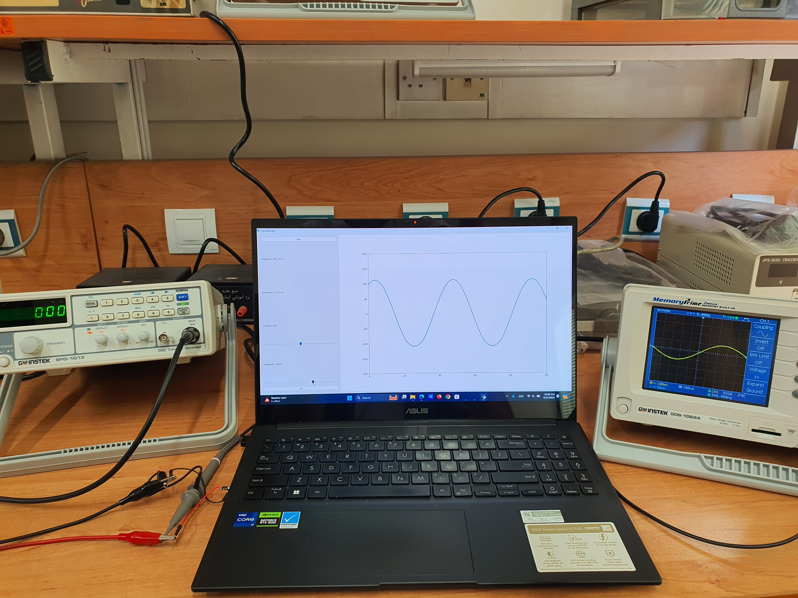
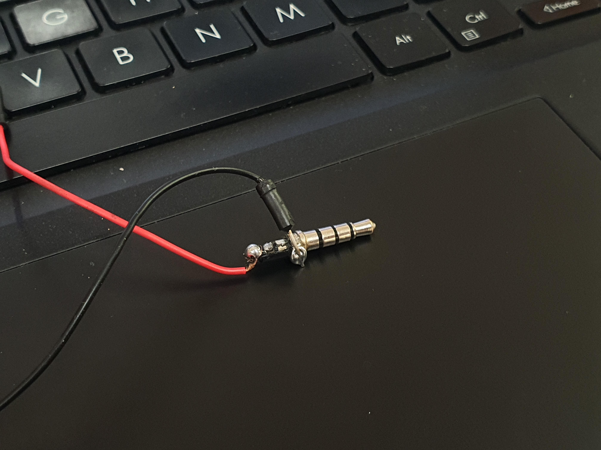
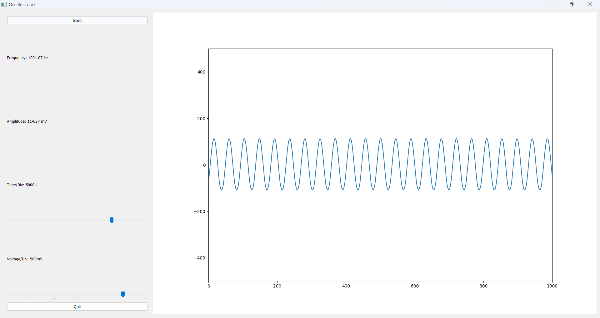
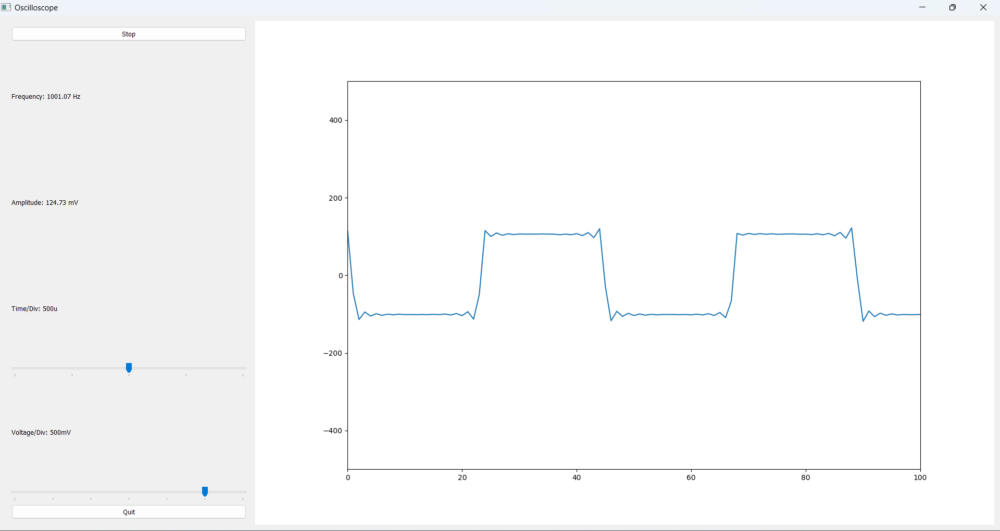
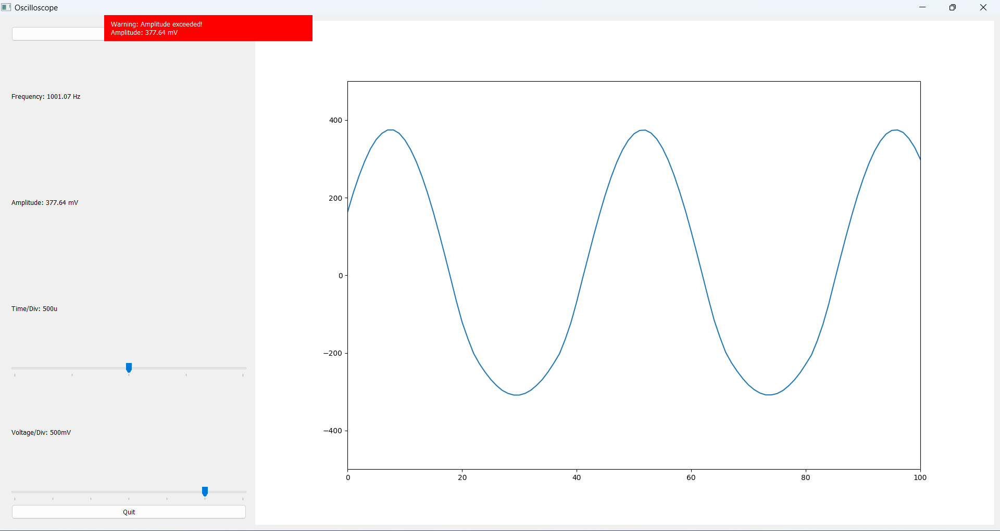

# Simple Oscilloscope Project

This project implements a simple oscilloscope using Python, allowing you to feed a signal to your laptop via its microphone jack and display the captured signal on its monitor.

## Features

- Real-time signal display
- Frequency and amplitude measurement
- Adjustable voltage and time divisions
- Support for sine, triangle, and square waves 
- GUI interface with start/stop functionality 

## Requirements

- Python 3.x
- PyQt5
- pyaudio
- numpy
- matplotlib

## Installation

1. Clone this repository:
   ```
   git clone https://github.com/Sina-Hashemi/Python-Oscilloscope.git
   ```
2. Install the required packages:
   ```
   pip install -r requirements.txt
   ```

## Usage

Run the script:

```
python3 Oscilloscope.py
```

## Code Overview

The main components of the oscilloscope are:

1. Audio input handling using `pyaudio`
2. Signal processing and FFT using `numpy`
3. GUI implementation using `PyQt5`
4. Real-time plotting using `matplotlib`

Key functions:

- `initialize_audio()`: Sets up the audio stream
- `update_plot()`: Updates the oscilloscope display in real-time
- `update_frequency_and_amplitude()`: Calculates and displays frequency and amplitude
- `update_voltage_div()` and `update_time_div()`: Adjust voltage and time divisions

## Limitations

- Maximum amplitude: Limited by the headphone jack specifications (typically up to 1.5V or 2.5V)
- Maximum frequency: Limited by the sound card capabilities (usually up to 48kHz)

## Screenshots


The app while running the code, will be as above.

The costomed headphone-jack that we made by soldering.

<p align="center">
   
   
   
</p>

## Contributing

Feel free to fork this project and submit pull requests with improvements or bug fixes.

## Authors

- Sina Hashemi
- Mahan Zamani
- MohammadHossein Sabzalian

---

**Note**: This project is for educational purposes only. The authors and contributors take no responsibility for any possible damage to your laptop or equipment.
